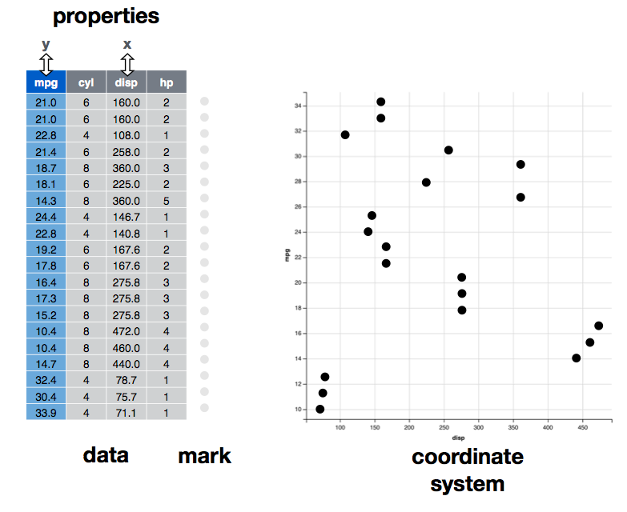
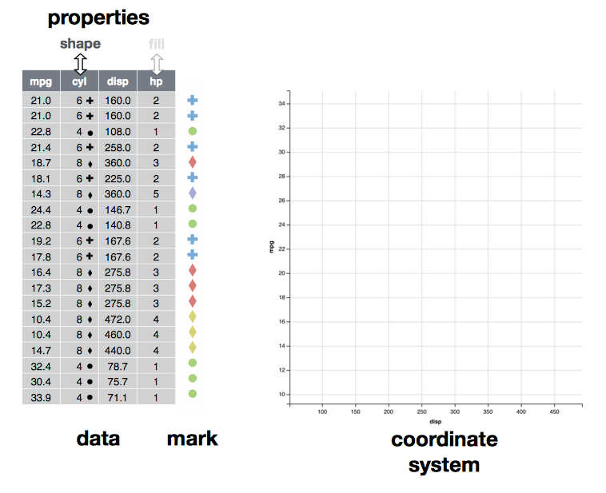
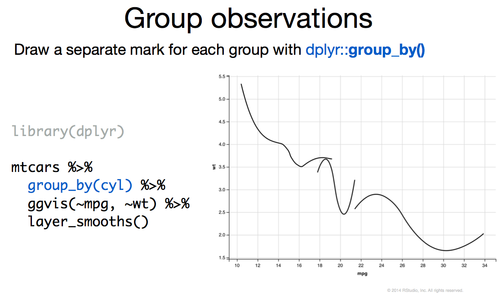
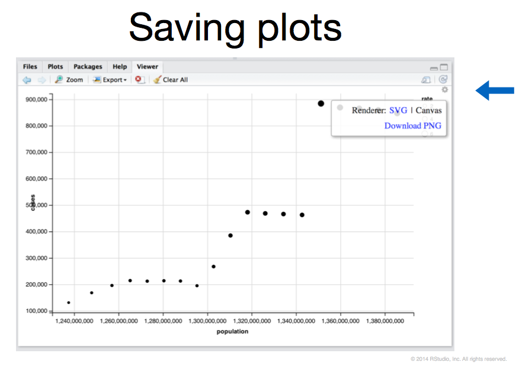

## ggvis

Another Hadley Wickham/RStudio joint.

ggvis is for interactive graphics.

- compatible with dplyr
- properties can be adjusted on the fly with inputs
- tooltips can show underlying data
- built on top of Vega (grammar of graphics) and 
- D3 (JavaScript Library for visualization/interactive data)
- Bleeding edge (interfaces may change from version to version)

Here is a great ggvis tutorial from [O'Reilly/Rstudio](http://cdn.oreillystatic.com/en/assets/1/event/120/ggvis_%20Interactive,%20intuitive%20graphics%20in%20R%20Presentation.pdf) - some of these slides are taken from this.

```{r,eval=TRUE,echo=FALSE,warning=FALSE}
library(ggplot2)
library(ggvis)
library(dplyr)
```

## ggplot2 versus ggvis

These will produce the same plots:

```{r,eval=FALSE}
ggplot(iris) + geom_point(aes(x=Sepal.Width, y=Sepal.Length, colour =Species)) +
  scale_color_manual(values= c("red", "green", "blue"))  
```

```{r,eval=FALSE}
iris %>% ggvis() %>% layer_points(x=~Sepal.Width, y=~Sepal.Length, 
                                  fill=~Species) %>%
  scale_ordinal(property="fill", range = c("red", "green", "blue"))
```

## ggplot2 versus ggvis

```{r}
ggplot(iris) + geom_point(aes(x=Sepal.Width, y=Sepal.Length, colour =Species)) +
  scale_color_manual(values= c("red", "green", "blue"))  
```

```{r}
iris %>% ggvis() %>% layer_points(x=~Sepal.Width, y=~Sepal.Length, 
                                  fill=~Species) %>%
  scale_ordinal(property="fill", range = c("red", "green", "blue"))
```

## Coming from ggplot2? We've got you covered.

Here is a rough mapping of ggplot2 concepts to ggvis.

```{r table2, echo=FALSE, message=FALSE, warnings=FALSE, results='asis'}
tab <- 
"|*ggplot2*   | maps to      | *ggvis* 
|:------------|:------------:|:----------------
|+            | ->           | %>%
|variable     | ->           | ~variable
|layer, geom  | ->           | layer function
|stat         | ->           | compute function
|aes()        | ->           | props()
|ggplot()     | ->           | ggvis()"
cat(tab)
```

## Mapping the data (x and y)



## Mapping the data (shape and fill)



## The %>% (Pipe)

The fact that ggvis uses the pipe (%>%) is super useful. It allows you to mix dplyr commands in with ggvis layers, allowing for much more flexibility than ggplot. This becomes especially useful in filtering and selecting data.

Note that it can become confusing, since dplyr refers to the variables as is (such as Sepal.Length), while you need a tilde (~) to refer to them in ggvis (~Sepal.Length).

```{r}
iris %>% mutate(sepalRatio = Sepal.Width / Sepal.Length, 
                petalRatio = Petal.Width / Petal.Length) %>%
  ggvis() %>% layer_points(x=~sepalRatio, y=~petalRatio, fill=~Species)
```

## What properties exist?

Look at the documentation for ?marks. Here are a few. Not all of these properties exist for every layer, so check the documentation for your layer of interest.

- x (x coordinate)
- y (y coordinate)
- width (width of mark)
- stroke (stoke color (outline) of mark)
- fill
- opacity
- size

## := (Unscaled) versus = (Scaled)

When you map a property to a variable, you have the option of being scaled (=) versus unscaled (:=). 

Scaled properties are mapped to graphical concepts. For example, if your variable ranges from 10-30 and you map it to the x property. You can change this behavior using the appropriate scale() function. 

Two scale functions you'll probably use the most are scale_numeric() (for continuous data) and scale_nominal() (for categorical data)

```{r}
iris %>% ggvis() %>% layer_points(x=~Sepal.Width, y=~Sepal.Length, 
                                  fill=~Species) %>%
  scale_numeric("x", domain = c(2,5))
```

## Unscaled Properties

Unscaled properties are used as raw values. If you have a unique identifier for each row in your data and you need to use this identifier to refer to another table, you would use it as an unscaled property. This is useful when adding tooltips to data. I'll show this in the demo.

Another reason to use unscaled properties is if the data directly maps to a concept, such as color. For example, say the iris data set had a color column that mapped to RGB values, you could directly use these values as an unscaled property.

More information at [http://ggvis.rstudio.com/properties-scales.html](http://ggvis.rstudio.com/properties-scales.html)

## Going from geoms to layers

There is a somewhat comprehensive mapping here:

[http://ggvis.rstudio.com/layers.html](http://ggvis.rstudio.com/layers.html)

## compute functions

ggvis provides some inline compute functions that will compute properties of the data. I don't really have time to talk about these, but they exist, and essentially you pipe the data through them.

- compute_smooth() - layer_smooth() uses this.
- compute_density()
- compute_model_predictions()
- compute_bin()

## group_by



## Interactive inputs to ggvis

ggvis can run standalone, or as part of shiny. For right now, we'll run it standalone, which means it will run in Rstudio. So we can use the various input functions to ggvis to modify our plots.

- input_slider(): a slider
- input_checkbox(): a check-box
- input_checkboxgroup(): a group of check boxes
- input_numeric(): a spin box
- input_radiobuttons(): pick one from a set options
- input_select(): create a drop-down text box
- input_text(): arbitrary text input

## Sliders
```{r}
iris %>% ggvis(x=~Sepal.Width, y=~Sepal.Length) %>% group_by(Species) %>%
  layer_smooths(span = input_slider(min = 0.5, max = 1, value =.5),se = TRUE) %>% 
  layer_points(fill=~Species) 
```      

## Checkbox in Action
```{r}
model_type <- input_checkbox(label = "Use flexible curve",
  map = function(val) if(val) "loess" else "lm")

iris %>% ggvis(x=~Sepal.Width, y=~Sepal.Length) %>% group_by(Species) %>%
  layer_points(fill=~Species) %>%
  layer_model_predictions(se = TRUE, model=model_type) 
```
  
## Keyboard Interactivity
```{r}
keys_s <- left_right(10, 1000, step = 50)
iris %>% ggvis(~Sepal.Width, ~Sepal.Length, size := keys_s, opacity := 0.5) %>% layer_points()
```

## Limits to Interactivity

Not everything is interactive. We can mostly only modify properties of the data visualization, but changing the property mapping dynamically requires some trickery. For example, if we had select boxes selecting what's being mapped on the x and y axis.

Look at the code for the [movie explorer](https://github.com/rstudio/shiny-examples/tree/master/051-movie-explorer) for an example of how to do this.

For modifying the data, I use dplyr to filter the data, or make the data a reactive expression. To do this, you have to embed your plot into a Shiny app.

## Running in Shiny

Instead of using the input functions such as input_slider(), you will simply use widgets that are specified in ui.R.

Two ways of doing so. You can just pipe the expression into bind_shiny() like this

```{r, eval=FALSE}
keys_s <- left_right(10, 1000, step = 50)
iris %>% ggvis(~Sepal.Width, ~Sepal.Length, size := keys_s, opacity := 0.5) %>% layer_points() %>% bind_shiny("ggvisPlot1")
```

You can also embed your ggvis plot into a Shiny reactive expression to get it to display. Then we pipe that reactive expression into bind_shiny()

```{r, eval=FALSE}
ggvisPlot <- reactive({
  keys_s <- left_right(10, 1000, step = 50)
  iris %>% ggvis(~Sepal.Width, ~Sepal.Length, 
                 size := keys_s, opacity := 0.5) %>% 
    layer_points()
})

ggvisPlot %>% bind_shiny("ggvisPlot1")
```

After you do this, you can embed the plot into ui.R with the ggvisOutput() function.

```{r, eval=FALSE}
ggvisOutput("ggvisPlot1")
```

## saving your ggvis figures



## Deploying your shiny apps

You can deploy your apps to a standalone R-server, or to shinyapps.io. Ask Ryan about setting up a Shiny server instance. (Hopefully coming soon to a ohsu server near you.)

shinyapps.io provides you with 25 compute hours for 5 applications for free. You'll need to download the shinyapps package, register on shinyapps.io, and obtain a key (allows Rstudio to directly deploy). 

Then you can simply deploy your app with shinyapps::deployApp(). 

## Thanks!

- Janice
- Rstudio/Hadley Wickham

## Coming Soon

Shiny/ggvis hackathon!

- Teams?
- Time? 
- What data?
- What kinds of Visualizations?
